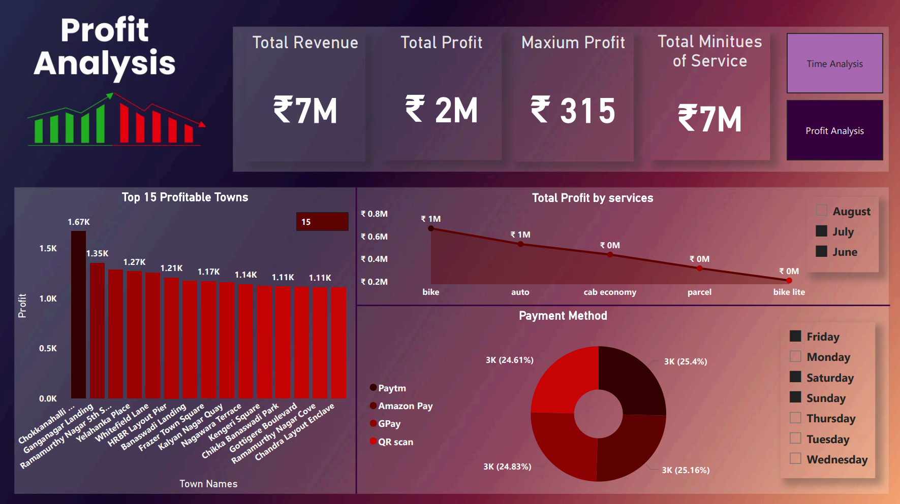

# 🚖 Ride Data Analysis Dashboard

## 📊 Project Overview
This project focuses on analyzing ride-booking data (similar to Ola/Uber datasets) to uncover key insights related to **demand patterns, revenue, and profitability**.

The analysis was performed using **Python, SQL, and Power BI**, transforming raw data into meaningful business insights through interactive dashboards.

---

## 🎯 Objectives
- Analyze ride demand across **hours, days, and services**
- Identify **peak booking times**
- Evaluate **revenue, cost, and profit trends**
- Discover **top-performing locations and services**
- Understand **customer payment preferences**

---

## 🛠️ Tech Stack
- **Python** → Data cleaning & preprocessing  
- **SQL** → Data extraction & querying  
- **Power BI** → Data visualization & dashboard creation  
- **Excel** → Initial data handling  

---

> ⚠️ Replace the image paths above with your actual uploaded image paths in the repo.

---

## 📈 Key Insights

### ⏱️ Time Analysis
- Peak bookings observed during **specific hours of the day**
- **Weekdays show higher ride activity** compared to weekends  
- Certain services like **bike & auto dominate usage**

### 💰 Profit Analysis
- Total Revenue: **₹7M+**
- Total Profit: **₹2M+**
- Identified **top profitable towns and services**
- Majority of transactions made via **digital payment methods (GPay, Paytm, etc.)**

---

## 📊 Features of Dashboard
- Interactive filters (Month, Day)
- Service-wise performance breakdown  
- Hourly booking trends  
- Profit distribution by location  
- Payment method analysis  

---

## 🚀 How to Use
1. Clone the repository  
2. Open the Power BI file (`.pbix`)  
3. Explore dashboards using filters and slicers  

---

## 📌 Future Improvements
- Add real-time data integration  
- Enhance predictive analytics (forecasting demand)  
- Deploy dashboard to Power BI Service  

---

## 📸 Dashboard Preview

### 📌 Time Analysis Dashboard

### 📌 Profit & Revenue Analysis Dashboard

## ⭐ If you found this useful, consider giving it a star!
